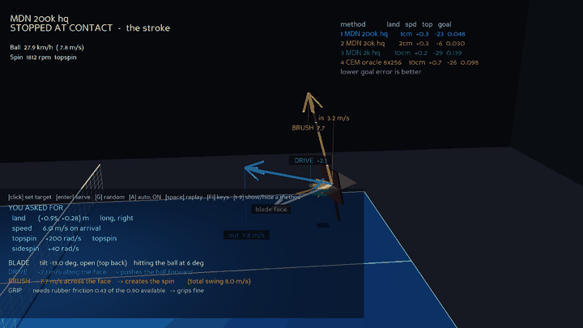
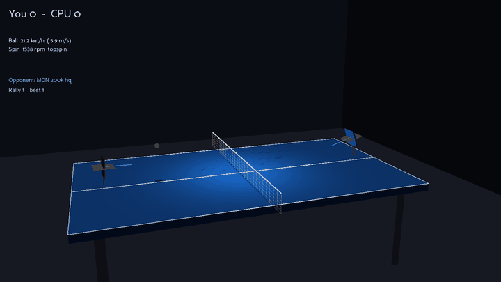
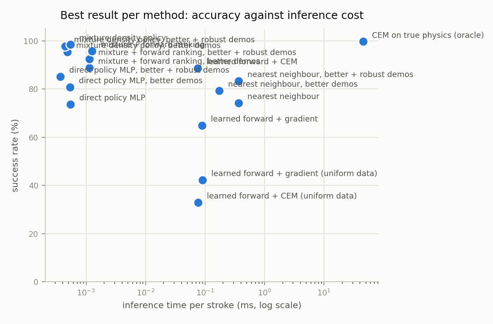
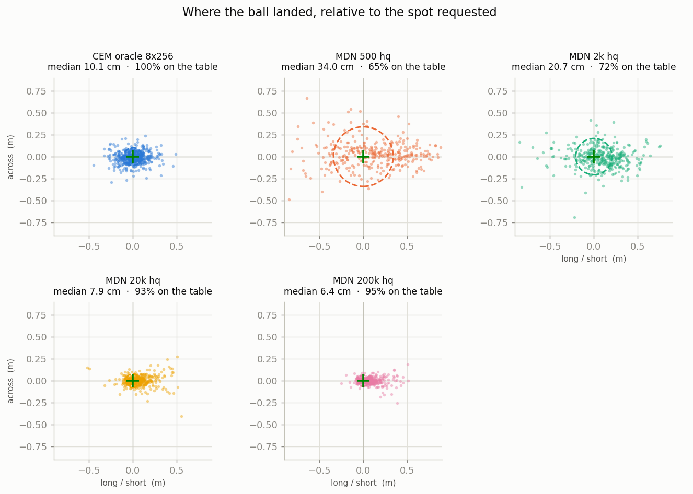
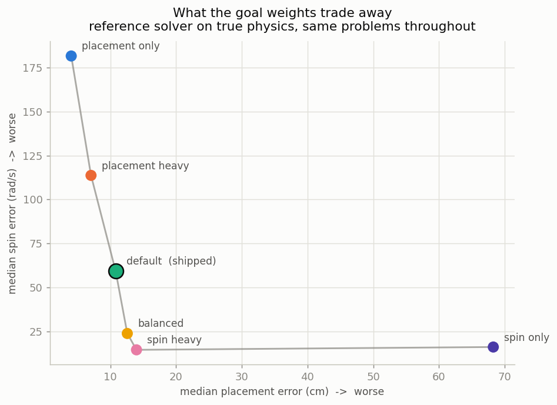

<div align="center">

# Table Tennis — the phone is the paddle

**A physics-accurate table tennis simulator you play with your phone,
and a study of how a machine learns to return a ball to a spot you choose.**



*Four models are asked for the **same shot** off the **same incoming ball**.
Each coloured arc is one method's answer; the rings are where each one
actually landed. The spread between them is the difference between the
methods and nothing else.*

</div>

---

## What this is

Two halves that share one physics engine, so nothing is modelled twice.

**A game.** Your phone is the paddle — the gyroscope drives blade angle and
swing power, a webcam places you. It plays without either (arrow keys and
space).

**A study.** Given the ball arriving at the strike plane, produce a stroke
that lands it **where you asked, at the speed you asked, with the spin you
asked**. Seven methods compete, from nearest-neighbour retrieval to a mixture
density policy, all scored by playing their stroke through the real physics.

| | |
|---|---|
| **7.0 cm** median placement at **97.7%** success | the best learned policy |
| **0.0005 ms** per stroke | against **46 ms** for the search it learned from |
| **53-stroke** rally | policy against policy, no scripting |
| **55 checks** | physics, orientation, encoding, agents |

---

## See it run

### Ask for a shot — four models attempt it

That is the animation at the top of this page. Click the table to place the
target, dial in speed and spin, press serve. The
stroke freezes at contact and breaks into its two components — **drive** along
the blade normal buys speed, **brush** across the face buys spin — then the
camera pulls out and follows the ball over the net to where it actually lands.

```bash
python ai_play.py --compare trainsize
```

### Rally against the trained policy

<div align="center">

</div>

*Both paddles driven by the same policy — there is no way to fake a person
convincingly and no reason to try. With a phone connected, the near paddle is
you.*

The opponent has never seen its own half. Every policy was trained on a ball
arriving in −x to be returned into +x, so the far side's problem is rotated
180° about the vertical into the frame the model knows and the stroke it
returns is rotated back out. The contact model is exactly invariant under that
rotation — `verify_learning.py` pins it to zero error rather than assuming it.

```bash
python rally_ai.py
```

---

## Results

Every method plays its chosen stroke through the **real physics**. No method
is ever scored on its own surrogate.

<div align="center">

</div>

| method | success | placement | goal error | ms/stroke |
|---|---:|---:|---:|---:|
| CEM on true physics *(the reference, not learned)* | **99.7%** | 18.7 cm | 0.361 | 45.7 |
| **mixture density policy**, better + robust demos | 97.7% | **7.0 cm** | 0.170 | **0.00045** |
| mixture density policy, better demos | 95.3% | **6.1 cm** | 0.161 | 0.00048 |
| mixture + forward ranking, better demos | 88.9% | 7.1 cm | **0.157** | 0.00114 |
| direct policy MLP, better demos | 80.7% | 11.5 cm | 0.158 | 0.00054 |
| nearest neighbour, better demos | 79.2% | 19.7 cm | 0.249 | 0.46 |

**A policy does not beat search — it amortises one.** The mixture policy
places better than the reference above (7.0 cm against 18.7 cm) because that
reference runs a fixed, modest budget and most of its 18.7 cm is search noise
rather than a limit of the task. Give the search more budget and it catches
up: a 10 × 512 CEM reaches 7.8 cm. The policy matches that for **0.00045 ms
instead of 798 ms** — five orders of magnitude — which is the actual result.

<table>
<tr>
<td width="50%"></td>
<td width="50%"></td>
</tr>
<tr>
<td><b>More data tightens the cloud.</b> Landing points relative to the spot
requested, one panel per training size.</td>
<td><b>The weights decide the trade-off.</b> What the shipped
<code>GOAL_WEIGHTS</code> gives up, measured on the true physics.</td>
</tr>
</table>

The full findings — covariate shift, the one-to-many problem, where data stops
buying anything, and what the robustness pass bought back — are in
[**Learning to return the ball**](#learning-to-return-the-ball) below.

---

## Setup

Python 3.12.

```bash
git clone https://github.com/maratlee1031/table-tennis-stroke-planning
cd table-tennis-stroke-planning
pip install -r requirements.txt
```

The physics, the solver and the game are NumPy; PyTorch is needed only for
the learned policies. MediaPipe and OpenCV are needed only for webcam
placement — without them the paddle follows the arrow keys.

```bash
python verify_physics.py        # 29 physics and orientation checks
python verify_learning.py       # 26 encoding, agent and comparison checks
```

Datasets and trained weights are **not** in the repository: they are large
and fully reproducible. Everything that needs them says so and falls back
gracefully. To build them (about an hour and a half, mostly demonstration
generation):

```bash
python train_ai.py all --sizes 500 2000 20000 200000 --demo-frac 1.0 \
       --expert-iters 8 --expert-pop 256 --eval-n 3000 --epochs 60
```

Then:

```bash
python ai_play.py --compare trainsize     # watch models play a shot you choose
python rally_ai.py                        # rally against the policy
python compare_models.py --compare method # the comparison as figures
```

---

## Playing it with a phone

Three terminals:

| Terminal | Command | Purpose |
|---|---|---|
| 1 | `python server.py` | HTTPS static server on :8443 (serves the phone page) |
| 2 | `python mp_sender.py` | Webcam hand tracking -> UDP :5005 (paddle placement) |
| 3 | `python main_wss.py` | The game plus WSS on :8766 |

For AI coach mode run `python coach_game.py` instead.

### Connecting the phone

1. Put the phone on the same Wi-Fi
2. Browse to `https://<PC-IP>:8443/controller.html` and accept the
   certificate warning
3. Tap `Use this page host` -> `Start` -> allow the motion sensors
4. **Hold it like a paddle (screen towards you, back towards the ball) and
   tap `Calibrate`** - without calibration the paddle will not move

If the WSS connection never opens: certificate exceptions are per host+port,
so open `https://<PC-IP>:8766` in another tab, accept the warning there, and
come back.

Playable without a phone or MediaPipe: arrow keys move the paddle, space
swings, `R` re-serves, `F1` toggles help.

## Controls

| Input | Source |
|---|---|
| **Swing timing** | gyroscope, against the predicted contact instant -- the main skill |
| Blade angle | phone orientation |
| Swing power and spin | phone gyroscope (`v = w x r`) |
| Stance | MediaPipe hand tracking, smoothed and **frozen during a swing** |

Watch the cyan ring on the strike plane: it marks where the ball will arrive
and shrinks as that moment approaches. Smallest means swing now.

## How the swing works

Hand position means two different things depending on when you look at it.
Before the swing it is placement; during the swing it is the stroke itself, a
wide arc covering most of a metre in about 200 ms. Feeding that straight to
the paddle (which the first version did) drags the paddle across the table.

`pingpong/stroke.py` handles both halves.

**Placement, with aim assist.** Your hand still decides where the paddle goes.
The assist measures how far that is from where the ball will actually arrive
and pulls the paddle the rest of the way -- fully inside `aim_full` (0.18 m),
fading to nothing by `aim_none` (0.50 m). Rough placement is rewarded; being
in the wrong place still misses. The timing ring turns green when the assist
can reach you and red when it cannot, so the feedback is immediate.

| hand is off by | assist | paddle ends up off by |
|---|---|---|
| 10 cm | 1.00 | 0 cm |
| 25 cm | 0.88 | 3 cm |
| 35 cm | 0.45 | 19 cm |
| 50 cm | 0.00 | 50 cm -- miss |

**The swing.** A detected swing plays a real backswing, sweep and
follow-through through that point, timed to arrive at the strike plane exactly
as the ball does. Amplitude scales with how hard you actually swung: about
40 cm of paddle travel at 3 m/s, 83 cm at 11 m/s. Swing too early and the
stroke completes before the ball arrives; too late and it is already past.

**Contact** is a swept test across the segment the ball travelled during the
frame, not a per-frame proximity check. At 60 fps a 5 m/s ball moves 8 cm per
frame while a proximity band is a couple of centimetres wide, so the old test
let fast balls tunnel straight through the blade. `HIT_RADIUS` (0.135 m) is
also deliberately larger than the drawn blade -- this is a game first.

Depth is excluded from placement entirely. The paddle waits at the ready plane
and the swing carries it forward, as in real table tennis -- which also means
a paddle left sitting still cannot return the ball by itself. Contact only
counts during the forward and follow-through phases.

Swing speed comes from the gyroscope rather than the accelerometer, because
web accelerometers are commonly limited to +/-2g and a real swing saturates
them exactly when accuracy matters most.

## Layout

```
pingpong/            physics core, no Panda3D, runs headless in batch
  constants.py       physical constants and table geometry
  quat.py            quaternion math, phone pose -> paddle pose
  physics.py         flight (RK4 + drag + Magnus) and contact impulses
  swing.py           swing velocity from the IMU
  stroke.py          stance / swing separation, the paddle motion state machine
  datalog.py         stroke record schema
  serve.py           serve solving and incoming-ball sampling
  dataset.py         state/action/goal encoding, dataset generation
  solver.py          CEM inverse solver and the demonstration generator
  models.py          network definitions and checkpoint I/O
  training.py        training loops and the shared evaluation
  agents.py          one act() per method: oracle, kNN, MLP, MDN, surrogates
  compare.py         run several planners on one problem; shared by both viewers
  stroke_card.py     a stroke described in physical terms
  progress.py        progress bars for the long steps
main_wss.py          the game (rendering + input)
coach_game.py        AI coach (CEM inverse solve for the stroke)
ai_play.py           watch models play a shot you choose, several at once
rally_ai.py          play a rally against a trained policy
sweep_weights.py     what GOAL_WEIGHTS trades away, on the true physics
verify_learning.py   checks for the encoding, agents and comparison layer
train_ai.py          the whole ML pipeline: data, train, eval, report
ml_report.py         figures and summary table from results.csv
compare_models.py    figures comparing planners on a shot you choose
plan_stroke.py       one stroke as a card, for hardware
controller.html      phone controller page
server.py            HTTPS server for the phone page
mp_sender.py         webcam hand tracking
analyze_strokes.py   plots and summary statistics from strokes.csv
verify_physics.py    physics and orientation checks (29 of them)
strokes.csv          human stroke data, written as you play (42 columns)
outputs/             figures written by analyze_strokes.py
runs/                datasets, checkpoints, results.csv, figures
```

Run the checks with `python verify_physics.py`.

## Analysing your play

```
python analyze_strokes.py
```

Reads `strokes.csv` and writes figures to `outputs/`: outcome breakdown,
landing scatter and density, swing speed vs ball speed, incoming vs outgoing
speed, vertical swing vs spin, and a 3D view of post-contact trajectories
replayed through the real physics and coloured by topspin/backspin.

To work out *how* to reach a particular spot, use the solver rather than this
script - `coach_game.solve_stroke` inverts the real physics with CEM instead
of averaging past strokes.

## Physics model

* Flight: `a = g - k_d*|v|*v + k_m*(w x v)`, integrated with RK4.
  The ball is only 2.7 g, so at 10 m/s the drag acceleration is 11.2 m/s^2 -
  larger than gravity. Trajectories are simply wrong without it.
* Contact: a standard rigid-body impulse model that first assumes the
  contact point sticks and switches to sliding once the tangential impulse
  would exceed `mu * J_n`. Topspin and backspin emerge from that friction
  model; nothing is special-cased.
* A table tennis ball is a **hollow** shell, `I = (2/3)mr^2` (not the 2/5 of
  a solid sphere), and that factor sets how tangential velocity converts
  into spin.
* Restitution is calibrated against the ITTF drop test: released from 30 cm
  it rebounds 24.7 cm (spec is 24-26 cm).
* Batch simulation runs about 7,500 trajectories per second, headless.

## Learning to return the ball

```
python train_ai.py all --sizes 500 2000 20000 200000 --demo-frac 1.0 \
       --expert-iters 8 --expert-pop 256 --eval-n 3000 --epochs 60
python ml_report.py                                  # figures + summary table
python ai_play.py --compare trainsize                # watch them play, side by side
python compare_models.py --compare trainsize         # the same comparison as figures
python plan_stroke.py --land 0.9 0.3 --speed 6 --topspin 250 # one stroke, in physical terms
```

`--sizes` names the **forward model's** dataset, and `--demo-frac` says what
share of it the policies get as demonstrations. The default 0.1 is a cost
heuristic -- a demonstration is a CEM solve, 320 simulations at the default
budget against one for a random sample -- but it silently caps the policy
ladder at a tenth of whatever you asked for. Reaching 200k demonstrations
through it would mean generating 2,000,000 random and mixed samples, and the
mixed set alone is 140,000 single-threaded solves for data no policy ever
reads. `--demo-frac 1.0` breaks the link and makes `--sizes` mean
demonstrations directly.

`--robust-k 8` picks demonstrations that survive being executed imperfectly
rather than the nominally best ones. It costs about 14% more generation time
and is worth it above roughly 20,000 demonstrations -- see below.

Demonstrations are generated across `--workers` processes (default: cores
minus two), which is the only parallel step and the slowest one: 200,000 at
the 8x256 budget takes about fifteen minutes on sixteen cores. That pins
every core at 100%, so on a laptop `--workers 6` is a kinder default.

### The task

Given the incoming ball at the strike plane, produce a stroke that achieves
a **five-part goal**: where it lands (x, y), how fast it arrives, how much
topspin, how much sidespin. The action is also five-dimensional -- blade yaw
and pitch, plus a paddle velocity vector -- so the problem is exactly
determined at best, and not every combination is reachable.

Goals are therefore sampled from what is demonstrably achievable: a random
stroke is played and whatever it produced becomes the goal. Every problem has
at least one solution by construction, so the comparison measures which
method finds one rather than who drew an impossible task.

### Methods compared

| | how it works |
|---|---|
| CEM on true physics | not learned; the reference. Searches the action space against the simulator |
| nearest neighbour | retrieval over solved strokes; what the first version of this project did |
| direct policy MLP | `(state, goal) -> action` by regression |
| mixture density policy | same inputs, but predicts a mixture over actions |
| mixture + forward ranking | the mixture proposes, a learned forward model picks |
| learned forward + CEM | learn `(state, action) -> outcome`, then search it |
| learned forward + gradient | same model, inverted by autograd |

Every method is finally scored the same way: play its chosen stroke through
the real physics and see what happened. No method is scored on its own
surrogate.

### What the experiments showed

**Covariate shift decides whether a forward model is usable at all.** Two
identical networks on 200k samples each, differing only in how the actions
were sampled: 88.6% success when the training set covers the good region,
**33.0%** when actions are uniform. Uniform strokes land in only 0.7% of the
time, so such a model is accurate on its own distribution -- 22 cm landing
error -- and hopeless where an optimiser actually goes, 145 cm, while
reporting a 0.02 chance of success for strokes that succeed 99.6% of the
time. `dataset.generate_mixed` exists for this reason.

**Part of the one-to-many problem is manufactured by a noisy teacher.**
Trained on demonstrations from the small-budget solver, the direct MLP goes
70.1% -> 71.0% -> 73.6% across three decades of samples and stops, while the
mixture policy climbs to 97.5%. That looks like a clean verdict on the model
class: many strokes reach the same goal, MSE regression converges on their
mean, and the mean of several valid strokes is usually not a valid stroke.

Re-running the same sweep on better-converged demonstrations complicates it,
and a fourth decade settles it:

| demonstrations | direct MLP, 5x64 teacher | direct MLP, 8x256 teacher |
|---|---|---|
| 500 | 70.1%, goal 0.392 | 60.8%, goal 0.356 |
| 2,000 | 71.0%, goal 0.401 | 74.4%, goal 0.307 |
| 20,000 | 73.6%, goal 0.332 | 79.3%, goal 0.177 |
| 200,000 | 73.7%, goal 0.328 | **80.7%**, goal **0.158** |

An under-converged search returns *different* answers to near-identical
problems, and that search noise is itself extra multimodality in the
training targets -- the very thing that breaks a unimodal regressor. Converge
the teacher and the target becomes closer to single-valued, and the plateau
moves: 73.6% became 79.3%.

But it is a plateau, not a slope. **The last decade of data bought the MLP
1.4 points** (79.3% -> 80.7%), against 19 points for the decade before it.
An earlier version of this section called the hq curve "still rising"; on
three points that was the honest reading, and the fourth point refutes it.
Both teachers put the MLP on a ceiling -- better demonstrations raise where
the ceiling is, they do not remove it. The mixture policy at the same data
reaches 95.3%, so the model class does genuinely matter; what the noisy
teacher had inflated was the *size* of that gap, not its existence.

**Better demonstrations buy accuracy and cost robustness.** With the
better-converged teacher every method's spin error roughly halves and every
goal error improves, but the mixture policy's success rate drops at every
data size:

| demonstrations | MDN, 5x64 teacher | MDN, 8x256 teacher | gap |
|---|---|---|---|
| 500 | 78.2%, goal 0.378 | 64.0%, goal 0.334 | -14.2 |
| 2,000 | 86.7%, goal 0.335 | 73.0%, goal 0.230 | -13.7 |
| 20,000 | 97.5%, goal 0.302 | 91.8%, goal **0.153** | -5.7 |
| 200,000 | 98.5%, goal 0.297 | 95.3%, goal 0.161 | **-3.2** |

Goals are sampled from what is achievable, and the demanding ones -- fast,
heavily spun, landing near an edge -- are exactly the ones a small budget
fails to solve. Its demonstrations are therefore systematically *safe*: they
miss the requested shot but stay on the table. The better solver actually
reaches those goals, and its solutions sit close to the edge of feasibility,
so a policy imitating them faithfully has less margin for its own error.

More data narrows the gap -- -14.2, -13.7, -5.7, **-3.2** -- and the fourth
point shows it narrowing more slowly, not closing. So this is a real
trade-off rather than a shortage of data: at 200k the safe teacher still
lands 3.2 points more often, and the accurate teacher is still worth
**1.8x** the shot quality (goal 0.161 against 0.297). Which one you want
depends on whether a miss costs you more than a sloppy hit.

**Most of that trade-off can be bought back.** If accurate demonstrations
fail more often because they sit on the edge of feasibility, then choosing
demonstrations that survive being executed imperfectly should recover the
margin without giving up the accuracy. `--robust-k` does exactly that -- it
re-ranks the solver's final candidates by how well they hold up under
perturbation -- and it had never been run:

| 200k demonstrations | success | placement | goal error | sidespin |
|---|---|---|---|---|
| mixture policy | 95.3% | **6.1 cm** | **0.161** | 63.7 |
| mixture policy, robust | **97.7%** | 7.0 cm | 0.170 | **38.3** |
| direct MLP | 80.7% | **11.5 cm** | **0.158** | 36.5 |
| direct MLP, robust | **85.2%** | 11.8 cm | 0.177 | 43.8 |

+2.4 and +4.5 points of success for 9 mm and 3 mm of placement. It also
undoes the sidespin regression above -- 63.7 -> 38.3, better than the 20k
model managed -- which fits the same explanation: that regression was the
optimiser spending spin once placement was nearly exhausted, and a stroke
bought that way is exactly the fragile kind the robustness pass rejects.

**But it is harmful on small data.** At 20,000 demonstrations it goes the
other way: the mixture policy drops 91.8% -> 90.9% and its placement nearly
halves in quality, 7.5 -> 11.3 cm. Re-ranking narrows the effective
candidate set, and when the demonstrations are already sparse that is
over-conservative rather than safer. `--robust-k` is a tool for the regime
where data is no longer the binding constraint.

**The weights, not the data, decide where the last decade of training
goes.** `sweep_weights.py` runs the reference solver under several
weightings of the same problems, so the frontier is measured on the true
physics with no learning in the way:

| weighting | placement | spin |
|---|---|---|
| placement only | **4.0 cm** | 181.6 |
| placement heavy | 7.1 cm | 113.7 |
| **default (shipped)** | 10.8 cm | 59.4 |
| balanced | 12.6 cm | **23.8** |
| spin heavy | 14.0 cm | **14.5** |
| spin only | 68.3 cm | 16.1 |

It is a clean L, and `GOAL_WEIGHTS` sits on its steep arm: moving from
`[1, 1, .6, .5, .5]` to `[1, 1, .8, 1, 1]` takes spin error 59.4 -> 23.8
rad/s for 1.8 cm of placement. Every "the model cannot do spin" reading in
this study is really a statement about that choice. Nothing here retrains a
policy under different weights -- that is still open.

**The best model in the study is the mixture policy on better
demonstrations**: 95.3% success, **6.1 cm** placement and 0.161 weighted goal
error at 200k demonstrations, at sub-millisecond inference. The 10 x 512
reference solver reaches 7.8 cm and 0.149 for 798 ms of search per stroke.

**Placement and goal error stop at different places.** Placement keeps
improving right through the last decade -- 20.8 -> 7.5 -> **6.1 cm** -- while
goal error flattens after 20k and then ticks the wrong way, 0.153 -> 0.161.
The four best models are now inside noise of each other on it:

| | success | placement | goal error |
|---|---|---|---|
| mixture policy, 20k demos | 91.8% | 7.5 cm | **0.153** |
| mixture + ranking, 200k | 88.9% | 7.1 cm | 0.157 |
| direct MLP, 200k | 80.7% | 11.5 cm | 0.158 |
| mixture policy, 200k | **95.3%** | **6.1 cm** | 0.161 |

Reading a single scalar as "which is best" stops working here. Success rate
still separates them cleanly, and on that the ranking is unambiguous.

**Spin error is inherited from the teacher, not imposed by the task.** Every
learned method sits at 65-110 rad/s of topspin error and it is tempting to
read that as a limit of a five-dimensional action trying to satisfy a
five-dimensional goal. It is not. Raising the reference solver's budget
sixteenfold improves spin *more* than it improves placement:

| dimension | CEM 5 x 64 | CEM 10 x 512 | improvement |
|---|---|---|---|
| topspin | 94.4 rad/s | 32.5 rad/s | 2.90x |
| sidespin | 94.7 rad/s | 36.9 rad/s | 2.57x |
| landing x | 0.14 m | 0.06 m | 2.44x |
| landing y | 0.08 m | 0.04 m | 2.17x |
| landing speed | 0.88 m/s | 0.51 m/s | 1.74x |

Spin is the dimension the search resolves *last*, so a small budget leaves
most of its error on the table. The policies were trained on 5 x 64
demonstrations and inherited exactly that. The ceiling here is demonstration
quality, which `--expert-iters` and `--expert-pop` control.

**Spin is also the dimension data stops buying first.** On the 8 x 256
teacher, topspin error is flat from 2,000 demonstrations onward while
placement improves by 3.4x over the same range:

| demonstrations | MDN placement | MDN topspin | MDN sidespin |
|---|---|---|---|
| 2,000 | 20.8 cm | 30.6 | 39.2 |
| 20,000 | 7.5 cm | 30.7 | 40.5 |
| 200,000 | **6.1 cm** | 33.9 | **63.7** |

The last row is not noise and it is not general: over the same decade the
direct MLP, kNN and the ranked mixture all improved their sidespin
(38.9 -> 36.5, 43.5 -> 41.6, 54.1 -> 41.3). **Only the mixture policy traded
sidespin away**, and it bought placement and success rate with it -- which is
what the weights ask for. `GOAL_WEIGHTS` scores landing at 1.0 and each spin
axis at 0.5, so once placement is nearly exhausted the cheapest remaining
gain is to give up spin. The regression is the objective working as
specified, not the model failing; it is visible in the goal error flattening
at the same point.

The practical consequence: if spin matters as much as placement for what you
are building, the fix is `GOAL_WEIGHTS`, not more data.

**Retrieval saturates completely; the parametric models do not.** Ten times
the stored strokes moved nearest neighbour's success rate by -0.1 points
(79.3% -> 79.2%), while the mixture policy on the same demonstrations went
91.8% -> 95.3%. Retrieval kept getting *closer* over that decade -- placement
21.8 -> 19.7 cm, goal error 0.268 -> 0.249 -- so more data does buy it a
better-matching neighbour. It just never converts that into a shot that
lands, because the nearest stored stroke was solved for a different incoming
ball and copying it does not adapt. This is the cleanest evidence in the
study for why the first version of this project needed replacing.

**The ranked mixture is a late starter, not a bad method.** It looks like the
weakest learned approach for three decades and then jumps:

| demonstrations | mixture + ranking, 8x256 |
|---|---|
| 2,000 | 38.2% |
| 20,000 | 54.2% |
| 200,000 | **88.9%**, goal **0.157** |

+34.7 points in one decade, the largest move of any method in the study. Its
two halves need data for different reasons -- the mixture has to propose a
good mode and the forward model has to rank modes correctly in a region it
has actually seen -- so it is starved until both are fed. Anything concluded
about it from a three-point sweep was premature.

**Nearly all failures are long, not short** -- see the outcome breakdown.
The failure mode is overhitting.

**A policy amortises the search rather than improving on it.** The mixture
policy appeared to beat the solver it learned from (12.0 cm placement against
18.7 cm), which should be impossible. It is not: the reference solver runs a
fixed, small budget, and most of that 18.7 cm was search noise rather than a
limit of the task. Giving it more budget settles the question:

| planner | success | placement | goal error | ms/stroke |
|---|---|---|---|---|
| CEM 5 x 64 (the budget used to make the training data) | 99.8% | 18.6 cm | 0.364 | 26 |
| CEM 8 x 256 | 100.0% | 11.2 cm | 0.200 | 347 |
| CEM 10 x 512 | 99.8% | 7.8 cm | 0.149 | 798 |
| mixture policy trained on the 5 x 64 solver | 97.8% | 11.4 cm | 0.308 | 0.25 |

So the policy did not surpass a well-resolved optimum. Trained on 20k noisy
solutions it recovered the systematic part and averaged the noise away,
reaching the placement quality of a **6x larger search at 1/1400 of its
cost**. On the full five-part goal it is still behind (0.308 against 0.200) --
it matches on placement, not overall.

This also bounds what the policies can currently learn: their demonstrations
are only 18.6 cm accurate. `--expert-iters` and `--expert-pop` raise the
demonstration budget, which should lift every policy trained on the result.

### Comparing methods against a shot you choose

```
python ai_play.py --list                    # what can be compared
python ai_play.py --compare trainsize       # one method at every data size
python ai_play.py --compare method          # every method at the largest size
python ai_play.py --compare mdn_200000_i8p256 policy_200000_i8p256 oracle
python compare_models.py --compare method --n 1000
python compare_models.py --compare trainsize --goal 0.9 0.3 6 250 0
```

Both read the same `pingpong/compare.py`, so the live view and the figures
can never disagree about what a method scored.

In `ai_play` the **first** contender plays the ball for real and the rest are
planned against the identical incoming ball and the identical request, then
drawn beside it -- so the spread between the arcs is the difference between
the methods and nothing else. `1`-`9` show and hide them. Only the first is
planned while the ball is in the air; the others are planned during the
frozen breakdown, which is why a 300 ms CEM oracle can sit in the comparison
without stalling the rally, and why the presets put the slow ones last.

`compare_models.py` runs the same contenders over the held-out set that
`train_ai.py` scores on, so its numbers line up with `results.csv`. Pass
`--goal` to point every method at one specific shot across many different
incoming balls -- that answers "how close does each get to *this* request",
which the sweep cannot.

The landing figure is faceted one panel per method rather than overplotted.
A scatter is judged on every pair of series colours at once, and only the
first three slots of the categorical palette clear that floor; one series per
panel has no pair to confuse. The per-dimension figure is split five ways for
the same kind of reason -- metres, m/s and rad/s cannot share an axis.

### Playing against it

```
python rally_ai.py                              # the best policy, full range
python rally_ai.py --model mdn_20000_i8p256     # an easier opponent
python rally_ai.py --difficulty 0.4             # gentler, more central returns
```

Controls are `main_wss.py`'s: the phone is the paddle, arrow keys and space
work without one. This is the half the project had been missing --
`main_wss.py` has a human returning serves from nothing, `ai_play.py` has a
model returning serves with no human in the room, and `coach_game.py` has the
solver commenting on your stroke. None of them put both players on the table.

**The opponent solves a mirrored problem.** Every policy was trained on one
situation: a ball arriving at the strike plane travelling in -x, to be
returned into +x. The opponent faces the reverse. Rather than ask the model
to extrapolate to a case it has never seen, the incoming ball is rotated 180
degrees about the vertical axis into the frame it knows, and the blade normal
and paddle velocity it returns are rotated back out. That is a rigid motion,
so the contact model is exactly invariant under it -- `verify_learning.py`
pins that to zero error rather than trusting it.

The same trick covers the arrival prediction: `physics.predict_plane_crossing`
only looks for a crossing in -x and returns None if the ball starts on the
far side, because it was written for a ball arriving at our end. Mirroring
first makes the opponent's problem the one it was built for, so there is one
implementation rather than two to keep in step.

### Using a stroke on hardware

`plan_stroke.py` prints a stroke card: blade normal (as a vector and a
quaternion), the paddle velocity split into a **drive** component along the
normal (which buys speed) and a **brush** component across the face (which
buys spin), the contact impulses, and `required_mu` -- the rubber friction
the stroke actually demands. That last one is the first thing to check
before trusting a stroke on real hardware: friction is a property of the
rubber, not something the model gets to choose, and a stroke needing 0.89
cannot be executed on rubber that provides 0.7. Rotation about the blade
normal is unconstrained, so an arm can use it freely.
